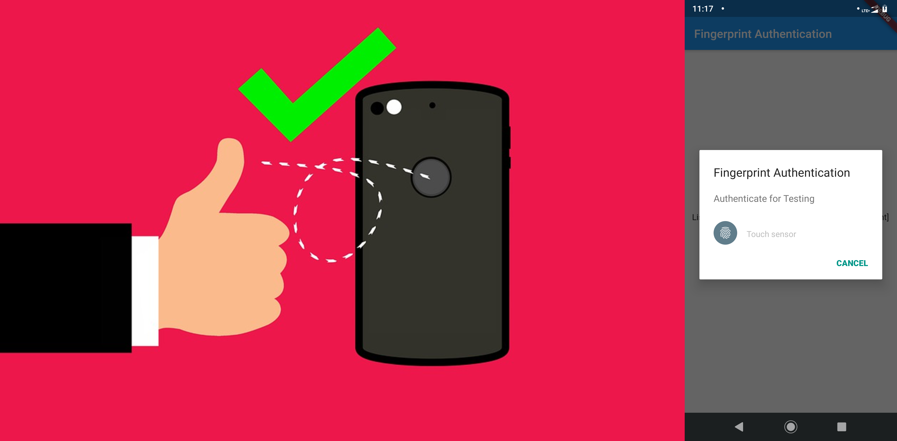

# flutter_fingerprint_auth

Fingerprint Authentication in Flutter

## Introduction
In this article we are talking about fingerprint authentication. As far as we have discussed about authentication like google, facebook, phone and email/password that will need authentication at server side. Fingerprint authentication is type of local authentication you can also include other biometric authentication like face,voice recognition as well in local authentication. We are only covering fingerprint authentication in this article. So tie your seat belt and let’s start :)))
I have found a plugin for local authentication and we are going to use it for fingerprint authentication.

Prerequisite: fingerprint sensor in mobile device you are testing on.

For help getting started with Flutter, view  
[online documentation](https://flutter.dev/docs), which offers tutorials, 
samples, guidance on mobile development, and a full API reference.
